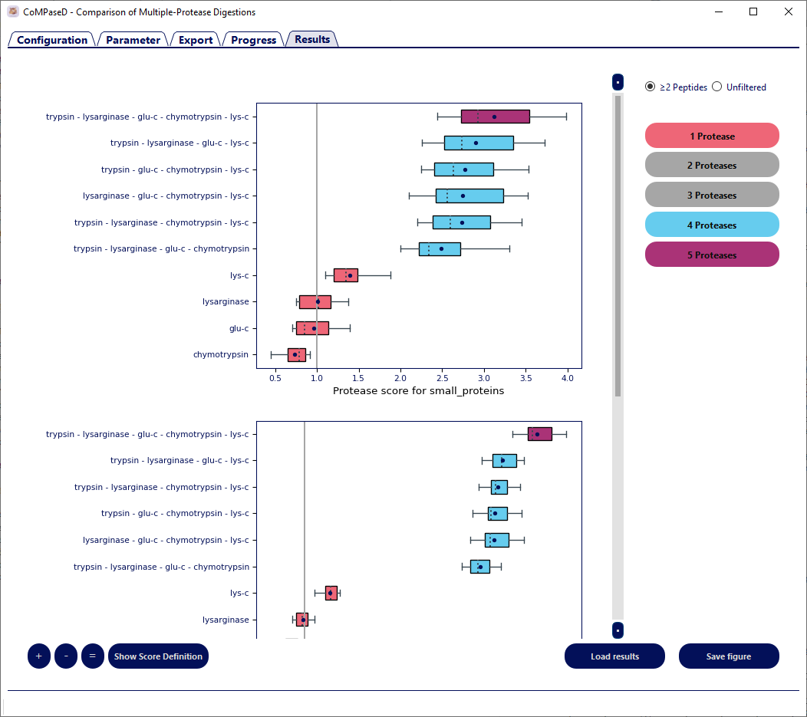

# Introduction to CoMPaseD

CoMPaseD contains three modules that can be run sequentially or independently of each other.

The first module is the export module. When executed, this module analyses the proteins in a user-provided protein database in `.fasta` format; determines the length of each protein in amino acids; and assigns a group based on the length of each protein. Further, virtual samples are generated by randomly assigning protein abundance or the absence of a protein for each round of sampling. These abundances are the raw probabilities that a unique peptide, generated by one of the specified proteases, will be selected during the random sampling process.
The result of the export is saved as a tab-delimited text file which can be edited by the user to modify protein grouping (for instance to replace the protein-length dependent classification with cellular localisation or biological functions) or to replace simulated protein abundance values with experimental results.

The second module (digestion) automates in silico digestion with several proteases and peptide-to-protein mapping of the results. For this purpose, proteases of interest and the maximal number of expected missed cleavage sites are extracted from the configuration file and a series of crux generate-peptides {cite}`test-citation` commands is executed with the corresponding parameters. Peptides are then mapped to the proteome, regardless of the cleavage sites of the corresponding protease. Considering only the peptide sequence but not the specificity of protease cleavage is of importance as we demonstrated earlier, that semi-specific cleavage occurs frequently during the analysis of small proteins [REF]. Therefore, peptides that are non-unique if semi- or un-specific cleavage is considered but that are unique when specific cleavage is assumed may lead to false-positive identifications. Thus, only peptides that map to exactly one position in the database are treated as unique peptides and kept for further analysis.
After annotating each peptide with the protease that generated it; the number of missed cleavage sites; the protein the peptide belongs to; and the position within the protein, a combined list of all potentially identifiable unique peptides is the output of the second module. Notably, identical peptides obtained by multiple proteases are considered unique for each of the proteases (e.g. peptides obtained by tryptic digestion can be the same as those obtained from Lys-C or Arg-C digestion). This resembles an experimental design where the samples from each digestion are analysed separately, rather than injecting a pooled peptide sample into the MS.
Again, the output is stored as a text file that may be used for other purposes, can be edited by the user, or generated by other means than CoMPaseD.

The analysis module is the third part of CoMPaseD. Repeated random sampling of peptides from the pool obtained by each protease is used to simulate the mass spectrometric measurement of a sample. For this aim, the assigned protein abundance is transferred to all peptides generated by a protein and used as a weighting factor for the likelihood to detect a peptide. This module optionally performs the prediction of peptide detectability by Deep MS-Peptide [REF]. If this option was enabled, the predicted detectability scores are used to further modify the weighting factor. Prior to random sampling, the total number of peptides required to sample is distributed between peptides with a particular number of missed cleavage sites based on their expected fraction.
After sampling, identified proteins are inferred from separate or combined peptide lists for each replicate and protease scores are calculated for each protein group. In accordance with the `two-unique peptides` rule [REF], the protease score is also calculated assuming this more stringent protein identification criterium. The individual calculated scores and results from each sampling are output to the file CoMPaseD_results.tsv, while the mean and standard deviation of the score for each combination and protein group are provided in the file `CoMPaseD_results_summary.tsv`.
It is noteworthy, that the current implementation while being able to predict the score for a group of proteins, is not suitable to select a single protein of interest. For such applications, existing programs, such as ProteaseGuru [REF] should be considered.

<!--  (TODO: Add reference)-->

# Using CoMPaseD

This section contains detailed information on how to run CoMPaseD.

CoMPaseD offers a command-line interface (CLI) and a graphical user interface (GUI).

```{important}
Before using CoMPaseD make sure to correctly install the tool with all dependencies. Please refer to the [Installation section](setup-installation).
```

```{note}
In this tutorial the displayed command-line calls use the `python` syntax. Depending on your operating system and setup different syntaxes might be possible (python3, python3.x, py, etc...)
Please make sure to use the syntax appropriate to your system setup.
```

(documentation-cli)=
## Command-line interface (CLI)

The command-line interface can be used by calling the `CoMPaseD_CLI.py` command.

All parameters required for the different steps of CoMPaseD can be set in the `parameters` file provided in the GitHub repository.

```{note}
Many of these parameters can be directly overwritten through  the command-line arguments.
```

A full list of command-line arguments with explanations can be displayed using the `-h` flag.

```bash
python CoMPaseD_cli.py -h
```

| Parameter Type            | Command Line Argument       | Description                                                                                                         |
|---------------------------|-----------------------------|---------------------------------------------------------------------------------------------------------------------|
| Help                      | -h, --help                  | show the help message and exit                                                                                      |
| Parameter File            | -p, --param_file            | path to CoMPaseD parameter file                                                                                     |
| CoMPaseD Mode             | -e, --export                | export simulated protein abundance values                                                                           |
| CoMPaseD Mode             | -d, --digest                | perform in-silico digest using crux toolkit                                                                         |
| CoMPaseD Mode             | -a, --analysis              | perform analysis from simulated protein abundance and in-silico digestion                                           |
| Digestion Mode Arguments  | --use_original_proteomapper | use original perl scripts for mapping in-silico digested peptides, this might be slower but requires less memory    |
| Digestion Mode Arguments  | --differentiate_I_L         | distinguish between peptide variants containing leucine or iso-leucine (default treat as identical)                 |
| Digestion Mode Arguments  | --indexing_key_len          | length in amino acids of the indexing keys for mapping                                                              |
| Analysis Mode Arguments   | --export_result             | path to CoMPaseD export result file with simulated protein abundance values and protein group assignment            |
| Analysis Mode Arguments   | --digestion_result          | path to CoMPaseD digestion result file ('unique_peptides_table_filtered')                                           |
| Overwrite Parameter File  | --out_folder                | change output directory                                                                                             |
| Overwrite Parameter File  | --fasta                     | change fasta file                                                                                                   |
| Overwrite Parameter File  | --score_peptide             | change weight of peptide IDs for protease score calculation                                                         |
| Overwrite Parameter File  | --score_protein             | change weight of protein IDs for protease score calculation                                                         |
| Overwrite Parameter File  | --score_coverage            | change weight of protein coverage for protease score calculation                                                    |
| Overwrite Parameter File  | --enzymes                   | change enzymes                                                                                                      |
| Overwrite Parameter File  | --mc                        | change maximal missed cleavage sites                                                                                |
| Overwrite Parameter File  | --mc_freq                   | change missed cleavage sites frequency                                                                              |
| Overwrite Parameter File  | --num_peps                  | change number of peptides to sample                                                                                 |
| Overwrite Parameter File  | --frac_peps                 | change fraction of generated peptides to sample                                                                     |
| Overwrite Parameter File  | --bins                      | change protein binning                                                                                              |
| Overwrite Parameter File  | --undetectable              | change undetectable protein fraction in protein bins                                                                |
| Overwrite Parameter File  | --DMSP_weight               | change weighting factor of Deep-MS-Peptide prediction                                                               |
| Overwrite Parameter File  | --DMSP_model                | change Deep-MS-Peptide prediction model path                                                                        |
| Overwrite Parameter File  | --samplings                 | change number of random samplings                                                                                   |
| Overwrite Parameter File  | --dynamic_range             | change dynamic range of protein abundance                                                                           |


To run the full analysis provided by CoMPaseD use the following command.

```bash
python CoMPaseD_cli.py -p path/to/parameters
```

To run specific parts of the analysis, the export (-e), digestion (-d) or result analysis (-a) flags can be used.

```bash
python CoMPaseD_cli.py -p path/to/parameter.param [-e] [-d] [-a]
```

```{note} The [-a] flag requires to run the rest of the analysis beforehand [-e] and [-d].
```

All result files are written to the folder/files indicated in the `parameters` file or given as command-line arguments.

### Advanced usage

For complex analyses or the comparison of different settings, CoMPaseD can be used in a command line mode by executing `CoMPaseD_CLI.py`. This also allows the automation of several analyses via shell scripts or batch files.

For example, the following commands in a Windows batch file would run an analysis with identical parameters for three different organisms and output the results to folders named `Organism_1`, `Organism_2` and `Organism_3`:

```bash
CoMPaseD_cli.py -p C:\CoMPaseD.param --out_folder C:\Result\Organism_1 --fasta C:\Organism_1.fasta
```

```bash
CoMPaseD_cli.py -p C:\CoMPaseD.param --out_folder C:\Result\Organism_2 --fasta C:\Organism_2.fasta
```

```bash
CoMPaseD_cli.py -p C:\CoMPaseD.param --out_folder C:\Result\Organism_3 --fasta C:\Organism_3.fasta
```

Similarly, the following command in a Linux shell script would run one analysis with each of the two Deep MS-Peptide models using an existing export and digestion file which was specified in the parameter file (note that there is no line break within each command):

```bash
python3 /home/user/CoMPaseD/CoMPaseD_cli.py -p /home/user/CoMPaseD.param -a --DMSP_model /home/user/CoMPaseD/bin/DeepMSPep_Confetti_Model.h5 --out_folder /home/user/results/confetti_model/
```

```bash
python3 /home/user/CoMPaseD/CoMPaseD_cli.py -p /home/user/CoMPaseD.param -a --DMSP_model /home/user/CoMPaseD/bin/DeepMSPep_Original_Model.h5 --out_folder /home/user/results/original_model/
```

Command line options will generally overwrite values in the parameter file and a parameter file with the used values will automatically be saved in the output folder together with the results.
The complete list of options available can be displayed by executing:

```bash
CoMPaseD_cli.py --help
```

(documentation-gui)=
## Graphical user interface (GUI)

CoMPaseD provides a graphical user interface that can be used instead of the command line interface.
The GUI consists of multiple tabs that represent the parameter setup and the different analysis steps.
For most analyses, the graphical mode will be the preferred option to operate CoMPaseD.

To access the GUI run the `CoMPaseD_gui.py` script:

```bash
python CoMPaseD_gui.py
```

### The Configuration tab


The configuration section provides options to set the path to the `Crux Toolkit` as well as changing the built-in ProteoMapper to the original `Perl-based Proteomapper`.

```{important} Upon the first program start an error message in the configuration tab indicates errors in the configuration file. Adjust the path to the crux executable and save the altered configuration. For subsequent program starts, the configuration tab should be skipped and CoMPaseD shows the analysis parameter tab directly.
When the checkbox to use original Perl-based ProteoMapper scripts is checked, paths to these scripts must be selected as well and the configuration saved again.
```

### The Parameter tab


All parameter settings can be modified in the parameter tab.

#### Fasta file

Select a protein database in `.fasta` format containing all target protein sequences from the proteome(s) of interest. This should be identical to the file used for database searching the experimental results but must not contain decoy entries.

#### Output folder

Specify the storage location of the result files. Missing folders will be created during the analysis. Ensure that CoMPaseD has permission to write and delete files within this folder.

#### Protease table

Specify available proteases in your lab and some additional properties. Protease names in the `Protease` column are limited to those available in the crux toolkit. Currently these are:

* `trypsin`
* trypsin/p
* `chymotrypsin`
* `elastase`
* clostripain
* cyanogen-bromide
* iodosobenzoate
* proline-endopeptidase
* staph-protease
* asp-n
* `lys-c`
* lys-n
* `arg-c`
* `glu-c`
* `pepsin-a`
* `elastase-trypsin-chymotrypsin`
* lysarginase

```{note} The highlighted proteases do not cleave when the cleavage site is followed by proline.
```

Specify the maximal number of expected missed cleavage sites (MCs) for each protease in the column `Max MCs` and the frequency of each number of MCs among all identified peptides from this protease in the column `MC frequency` ordered by increasing MCs. Remember to include a value for peptides without MC. As digestion protocols and protease efficiency can vary greatly between labs and enzyme vendors, this parameter should be approximated by the results from earlier experiments in the same group if possible. However, for some commonly used proteases, we aggregated this information from 8 published datasets from different groups and provide typical values based on this literature review as default settings (see Supplemental Methods B-1 for details).

<!-- (TODO: Change the referencing system to fit the documenation)-->

Moreover, the expected number of identified unique peptides (alternatively, the fraction of identified peptides of all unique peptides generated) can be set for each protease in the column `Number of Peptides` (alternatively: `Fraction of Peptides`). Again, this value depends strongly on the experimental setup and can vary for both, individual proteases and experimental details. Nonetheless, a gross estimate based on results from similar experiments is usually sufficient for the selection of a protease combination.

#### Protease binning

Because CoMPaseD was developed to compare the suitability of different proteases or their combinations to detect small proteins, proteins can be grouped based on their length in amino acids in the `Protein size binning (aa)` field and the protease score is calculated for each group individually. Additionally, a fraction of proteins from each bin can be defined as non-expressed (`Undetectable fraction (%)` field). This can be useful, e.g. when working with a database containing in-silico predicted sORFs which mostly will not be expressed in-vivo. Setting a high fraction of undetectable proteins for the small protein fraction could then compensate for the bias against large proteins. Vice versa for experiments involving the enrichment of small proteins, a greater fraction of the large proteins can be set as undetectable to reflect their depletion. Notably, the grouping scheme can be replaced by user-defined annotations (e.g. cellular localisation) in the export tab using annotation files. These files should be tab-delimited and contain the protein identifier as appearing in the export tab in a column with the header `Identifier`.

#### Deep MS-Peptide settings

Enable or disable the prediction of peptide detectability by Deep MS-Peptide [REF]. If enabled the weighting factor for each peptide during random sampling will be modified accordingly. The original Deep MS-Peptide model was designed to provide a sharp cutoff between detectable and non-detectable peptides and was trained on data from The Global Proteome Machine Database (GPMDB) [REF], which, owing to the frequent usage of trypsin in MS experiments, mainly contains tryptic peptides. Therefore we trained an alternative model based on the peptides detected within the Confetti dataset [REF]. This dataset consists of several measurements of HeLa digestions with various proteases, likely making it more suitable to train a model for the prediction of peptide detectability with different proteases. Both, the original model and the newly trained model are available from the CoMPaseD github repository. The `prediction weight` is a multiplier to define the importance of peptide detectability relative to the protein/peptide abundance.

<!-- (TODO: Add reference)-->

#### Further settings

While the protease score increases with additional proteases, due to limited sample amount, instrument availability, etc. it is often not feasible to apply more than a few proteases in praxis. If the number of available proteases exceeds this number, the parameter `Maximal proteases` can be used to limit the number of proteases in a single combination and thereby reduce calculation time.
The number of `Random samplings` defines the number of repeated predictions of the protease score. These samplings are carried out on individually initialised protein abundances and apply random peptide sampling for each prediction.
Cellular protein abundances follow roughly a distribution function called Generalized Inverse Gaussian [REF -Koziol 2013] and CoMPaseD randomly assigns protein abundances from a value pool with such a distribution spanning 10 orders of magnitude. However, the dynamic range of a proteomics experiment is typically limited. This is reflected by the option `Dynamic range` which reduces the probability to detect proteins outside the dynamic range. Larger values will result in more proteins identified but with fewer peptides per protein.

<!-- (TODO: Add reference)-->

#### Protease score weights

The protease score is the weighted geometric mean of the number of identified proteins, the number of identified peptides and the average sequence coverage normalised against the same values from tryptic digestion. The weight for each of these metrics can be adjusted here.

#### Save/Load parameters

Save current settings to a parameter file or load settings from a parameter file. Parameters will also automatically be saved when an analysis is started.

### The Export tab


Once all settings are made, switching to the export tab will generate a table containing one row per protein in the `.fasta` file and additional columns with randomly initialised abundance values for each protein for each round of random sampling. Abundance values of 0 indicate proteins that are excluded as not expressed in the corresponding sampling round.
This table can manually be edited; generated again with new abundance values by clicking `Sample proteins`; or new protein grouping can be assigned by `Load annotation`.

```{hint} Saving this table allows for repeating analyses with different settings, e.g. for the specificity of proteases or the number of identified peptides while keeping abundance values constant. However, due to the semi-random nature of subsequent peptide sampling, slightly different results are expected for each run even when parameters are kept constant.
```


### The Progress tab

<!-- (TODO: Missing image)-->

The actual analysis can be started on the progress tab, either by starting a complete analysis (`Start pipeline`) or by starting separately the digestion or analysis part (`Start digest`, `Start analysis`). The latter can be useful when multiple analyses with the same database and proteases (including the maximal number of missed cleavage sites) are carried out. In such cases, the `unique_peptides_table_filtered.tsv` indicated in the automatically saved parameter file can be re-used and analysed by loading this parameter file, adjusting the parameters and starting the analysis directly.
While the analysis is running, progress is printed to the window and parameters can not be changed.

### The Results tab



After the analysis has finished, results can be visualised in the results tab. A separate plot is generated for each group defined in the export tab. The radio boxes `≥2 Peptides` and `Unfiltered` toggle between scores calculated from all identified proteins or calculated after filtering for at least two unique peptides per protein. The plots can be further customised by removing combinations with a particular number of proteases.

# Result files

<!-- (TODO: Add section about result files and explanations on the different columns in the result tables)-->