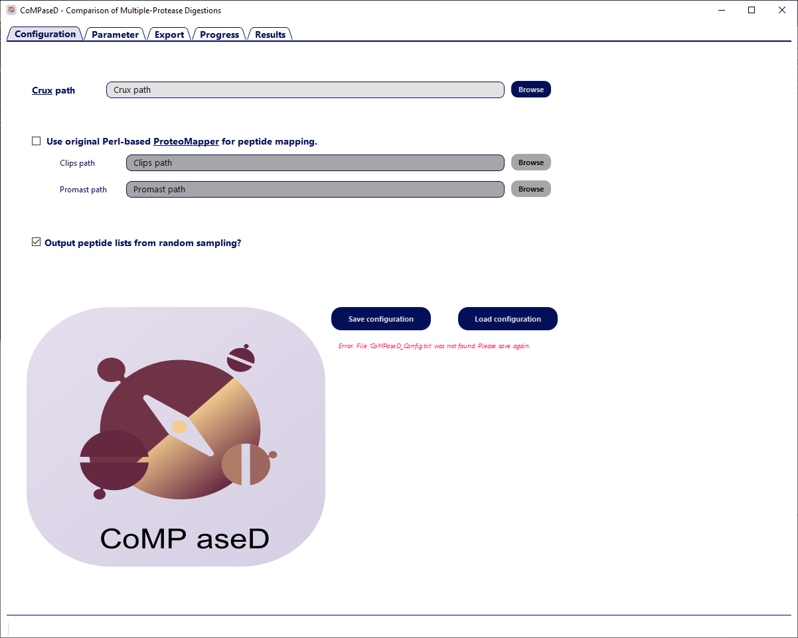
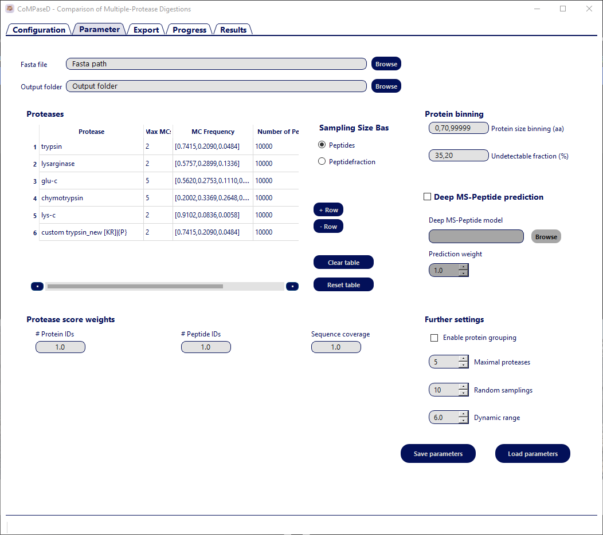
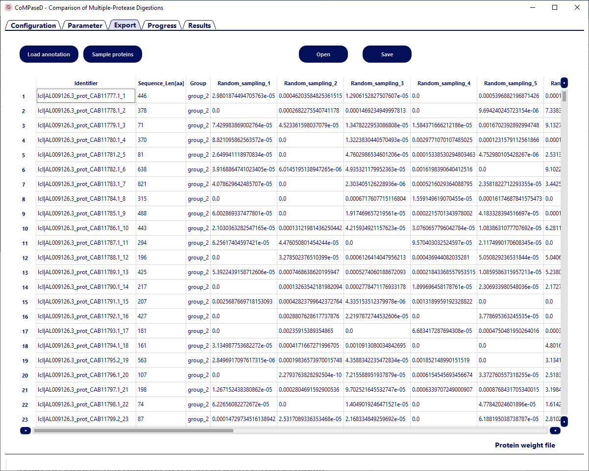
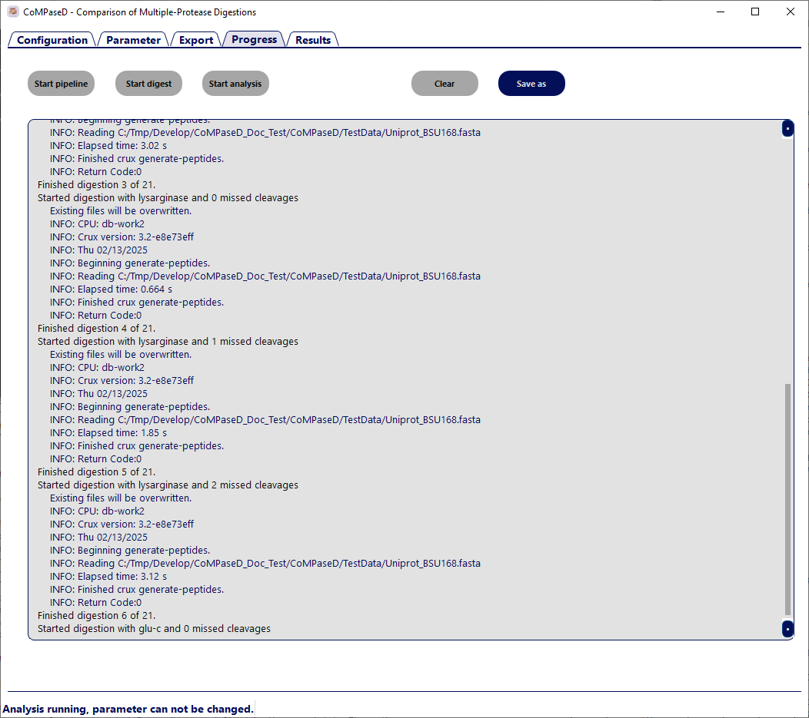
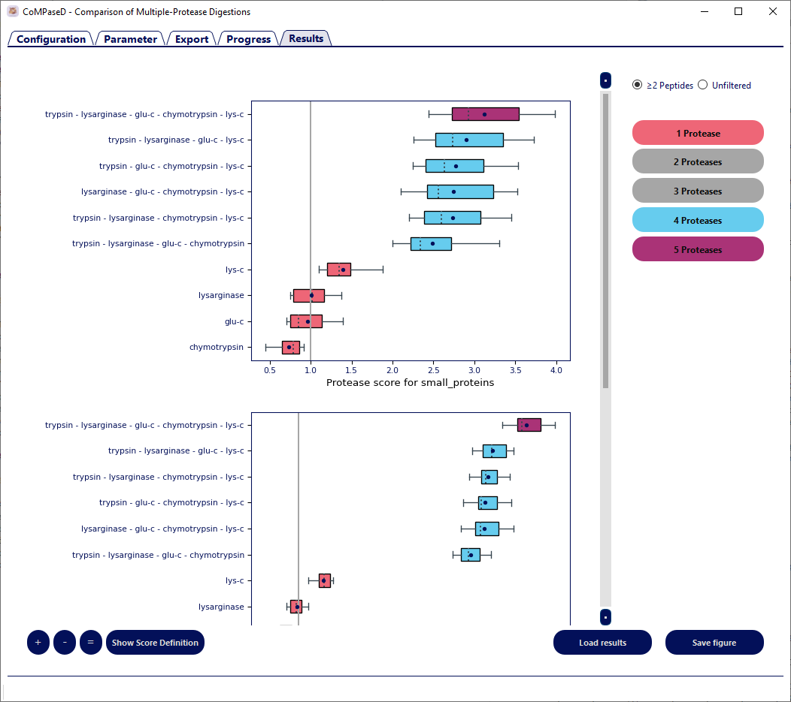

(reference-gui)=
# Graphical User Interface (GUI)

CoMPaseD provides a graphical user interface that can be used instead of the command line interface.
The GUI consists of multiple tabs that represent the parameter setup and the different analysis steps.
For most analyses, the graphical mode will be the preferred option to operate CoMPaseD.

To access the GUI run the `CoMPaseD_gui.py` script:

```bash
python CoMPaseD_gui.py
```

## The Configuration tab



The configuration section provides options to set the path to the `Crux Toolkit` as well as changing the built-in ProteoMapper to the original `Perl-based Proteomapper`.

```{important} Upon the first program start an error message in the configuration tab indicates errors in the configuration file. Adjust the path to the Crux executable and save the altered configuration. For subsequent program starts, the configuration tab should be skipped and CoMPaseD shows the analysis parameter tab directly.
When the checkbox to use original Perl-based ProteoMapper scripts is checked, paths to these scripts must be selected as well and the configuration saved again.
```

## The Parameter tab



All parameter settings can be modified in the parameter tab.

### Fasta file

Upload a **FASTA** file containing the protein sequences from the proteome(s) of interest. This file should be identical to the one used during database searching for experimental results but **must not include decoy sequences**.  
*Parameter file: [Fasta](params-fasta)*  


### Output folder

Specify the directory for saving the result files. If the folder does not exist, it will be **created automatically** during the analysis. Ensure that CoMPaseD has the necessary **write and delete permissions** for this directory.  
*Parameter file: [Output_directory](params-output_dir)*  

### Protease table

This table lists the available proteases in your lab along with relevant properties. The names specified in the **Protease column** must match those supported by the Crux toolkit, which currently includes:

* `trypsin`
* trypsin/p
* `chymotrypsin`
* `elastase`
* clostripain
* cyanogen-bromide
* iodosobenzoate
* proline-endopeptidase
* staph-protease
* asp-n
* `lys-c`
* lys-n
* `arg-c`
* `glu-c`
* `pepsin-a`
* `elastase-trypsin-chymotrypsin`
* lysarginase  

```{note} 
The highlighted proteases do not cleave when the cleavage site is followed by proline.
```

Additionally, **custom enzymes** can be specified using the *custom* keyword followed by a freely definable name and the protease specificity. Specificity must be defined as in crux by two pairs of squared or curly brackets enclosing residues N-terminal and C-terminal to the cleavage site. Residues in squared brackets trigger cleavage, those in curly brackets prevent it.   
*Example*: `custom trypsin_new [KR]|{P}` will create a custom protease named trypsin_new in the output that cleaves C-terminal to K and R residues if those are not followed by P.  
*Parameter file: [Proteases](params-proteases)*  


The **Max MCs column** specifies the maximum number of missed cleavage sites (MCs) expected for each protease. The **MC frequency column** defines the distribution of MCs across all identified peptides for each protease. This should be listed in ascending order of MCs, including a value for peptides without missed cleavages, and values for different proteases can be separated by square brackets.  
*Parameter file: [Max_MCs](params-max_mc)*  
*Parameter file: [Freq_MCs](params-freq_mc)*  
  
Since protease efficiency and digestion protocols can vary significantly between laboratories and enzyme vendors, it is recommended to approximate these parameters using data from prior experiments within your group. For commonly used proteases, CoMPaseD provides default values based on an aggregation of data from eight published datasets. These values can be loaded by clicking `Reset table`.  

The expected **number of identified unique peptides**, or alternatively, the **fraction of all possible unique peptides**, can be configured for each protease under the columns **Number of Peptides** or **Fraction of Peptides**, respectively. To toggle between both options, use the radiobuttons below `Sampling Size Based`.  
Although these values are highly dependent on the experimental setup, a rough estimate from similar experiments is usually sufficient to guide the selection of an optimal protease combination.
*Parameter file: [Sampling_Size_Based_On](params-sampling_based_on)*  
*Parameter file: [Peptides_Sampling_Size](params-pep_number)*  
*Parameter file: [Pep_Level_Proteome_Cov](params-pep_coverage)*  
  

  
### Protein binning  

CoMPaseD is designed to compare the suitability of different proteases or combinations for detecting small proteins. Thus, proteins can be grouped by length using the **Protein size binning (aa)** setting, with protease scores calculated separately for each group. To this aim, protein length values are provided as a comma-separated list, *e.g.* `0,70,99999` to create two bins: i) proteins up to 70 amino acids length, and ii) proteins between 71 and 99,999 amino acids length.  
*Parameter file: [Bins](params_bins)*  

An undetectable fraction of the proteins can also be specified for each protein group in the **Undetectable fraction (%)** field. This is particularly useful when working with databases containing *in-silico* predicted small open reading frames (sORFs), which are often not expressed *in vivo*. In such cases, a high undetectable fraction can compensate for the inherent bias against large proteins. Conversely, if the experiment involves enrichment of small proteins, the undetectable fraction for large proteins can be increased to reflect their depletion.  
*Parameter file: [Not_expressed_fraction](params_undetectable)*  

Protein groups can also be customised using user-defined annotations (e.g. cellular localisation) by uploading tab-delimited annotation files in the [export tab](gui_export). These files must contain a column named **Identifier** corresponding to protein identifiers in the export tab and at least one column for protein grouping.  


### Deep MS-Peptide settings
  
**Deep MS-Peptide prediction** {cite}`DMSP-citation` can be enabled or disabled for predicting peptide detectability. If enabled, the weighting factor for each peptide during random sampling is adjusted based on its predicted detectability.  
*Parameter file: [Use_DeepMSPeptide_Predictions](params_use_dmsp)*  

The **original Deep MS-Peptide** model was trained on data from [The Global Proteome Machine Database](https://gpmdb.thegpm.org/) (GPMDB, {cite}`GPMDB-citation`), which mainly includes tryptic peptides due to the prevalence of trypsin in mass spectrometry experiments. To accommodate a broader range of proteases, an **alternative model** was trained using data from the Confetti dataset {cite}`Confetti-citation`, which includes HeLa digestions with various proteases. Both models are available together with CoMPaseD and can be selected in the **Deep MS-Peptide model** field.  
*Parameter file: [Path_DeepMSPeptide_Model](params_dmsp_model)*  

The **Prediction weight** parameter adjusts the influence of peptide detectability relative to protein/peptide abundance.  
*Parameter file: [Weights_DeepMSPeptide_Predictions](params_dmsp_weight)*  


### Further settings  

CoMPaseD considers only unique peptides per protease by default. If all peptides should be considered and protein groups be built, the option **Enable Protein Grouping** can be activated. The median number of peptides per protein in the group and the median sequence coverage in the group will be considered the representative value of the group for calculating the protease score.  
*Parameter file: [Use_Unique_Peptides_Only](params-unique_peptides_only)* (Note that the parameter value is True by default, i.e. do not enable protein grouping.)  

The protease score typically increases with the number of proteases used. However, due to constraints like sample availability and instrument time, it is often impractical to use too many proteases. The **Maximal proteases** setting limits the number of proteases combined in a single analysis.  
*Parameter file: [Number_of_Proteases](params_max_proteases)*  

The **Random samplings** parameter specifies the number of repeated simulations for protease score prediction. Each repetition is based on randomly initialised protein abundances and random peptide sampling, contributing to a robust statistical distribution.  
*Parameter file: [Sampling_Number](params_n_samplings)*  

Protein abundance values are randomly drawn from a Generalized Inverse Gaussian distribution {cite}`AbundanceDistribution-citation` spanning 10 orders of magnitude, reflecting the typical dynamic range of cellular protein expression. The **Dynamic range** parameter limits peptide detection to reflect the dynamic range of a given proteomics experiment. Higher values increase protein identifications but reduce the number of identified peptides per protein.  
*Parameter file: [Protein_dynamic_range](params_dynamic_range)*  

### Protease score weights  

The protease score is calculated as the weighted geometric mean of:  

   1) The number of identified proteins (**# Protein IDs**)  
   2) The number of identified peptides (**# Peptide IDs**)  
   3) The average sequence coverage (**Sequence Coverage**)  

These metrics are normalised against tryptic digestion results. The relative importance of each metric can be adjusted by changing the corresponding weight.  
*Parameter file: [Protein_IDs_weight](params_weight_prot)*  
*Parameter file: [Peptide_IDs_weight](params_weight_pep)*  
*Parameter file: [Coverage_weight](params_weight_cov)*  

### Save/Load parameters

Save current settings to a parameter file or load settings from a parameter file. Parameters will also automatically be saved when an analysis is started.  

(gui_export)=
## The Export tab



Once all settings are made, switching to the export tab will generate a table containing one row per protein in the FASTA file and additional columns with randomly initialised abundance values for each protein for each round of random sampling. Abundance values of zero indicate proteins that are excluded as not expressed in the corresponding sampling round.
This table can manually be edited; generated again with new abundance values by clicking `Sample proteins`; or new protein grouping can be assigned by `Load annotation`.
For further details on this table, refer to [ProteinAbundance.tsv](result-protein_abundance).  
*Parameter file: [Protein_weight_file](params_protein_abundance_file)*  


```{hint} 
Saving this table allows for repeating analyses with different settings, e.g. for the specificity of proteases or the number of identified peptides while keeping abundance values constant. However, due to the semi-random nature of subsequent peptide sampling, slightly different results are expected for each run even when parameters are kept constant.
```  


## The Progress tab  

  

The actual analysis can be started on the progress tab, either by starting a complete analysis (`Start pipeline`) or by starting separately the digestion or analysis part (`Start digest`, `Start analysis`). The latter can be useful when multiple analyses with the same database and proteases (including the maximal number of missed cleavage sites) are carried out. In such cases, the `unique_peptides_table_filtered.tsv` indicated in the automatically saved parameter file can be re-used and analysed by loading this parameter file, adjusting the parameters and starting the analysis directly.
While the analysis is running, progress is printed to the window and parameters can not be changed.

## The Results tab



After the analysis has finished, results can be visualised in the results tab by loading [`CoMPaseD_results.tsv`](CoMPaseD_results) via the `Load results`button.  
A separate plot is generated for each group defined in the export tab. The radio boxes `≥2 Peptides` and `Unfiltered` toggle between scores calculated from all identified proteins or calculated after filtering for at least two unique peptides per protein. The plots can be further customised by removing combinations with a particular number of proteases.